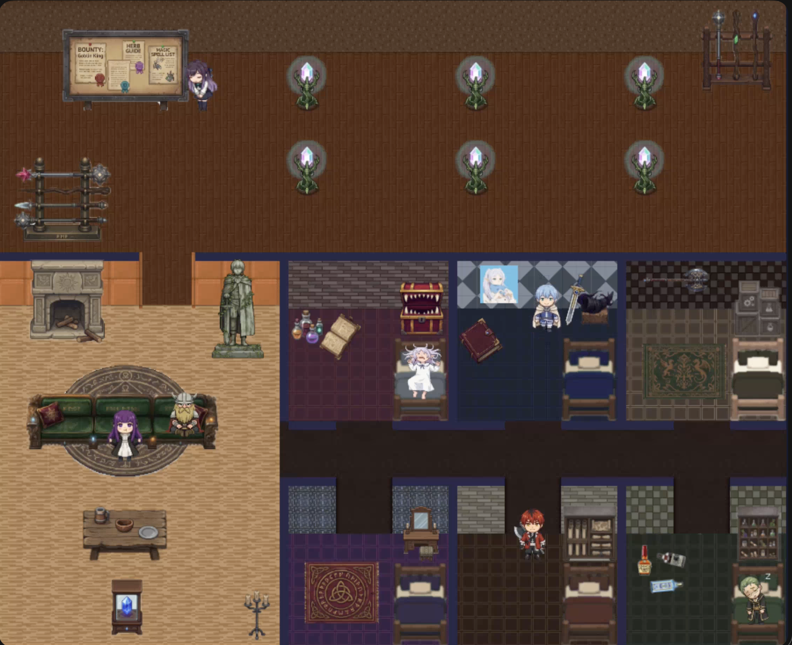
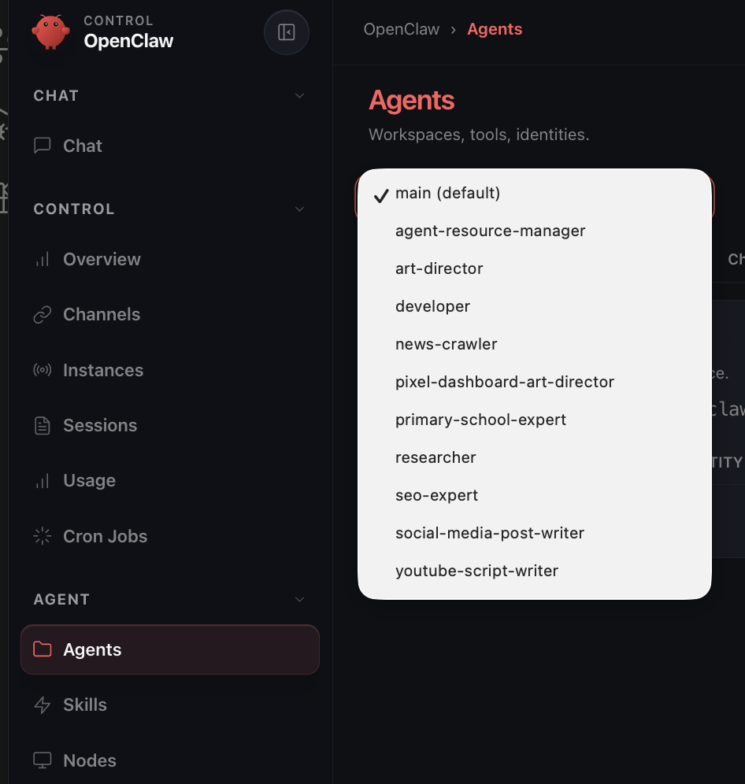

# OpenClaw Character Dashboard — English Guide

Author: An IT-a

[Subscribe and Follow me! ❤️](https://profile.an-it-a.com/)



---

> **Other guides**
>
> - Chinese version: [README.md](./README.md)
> - Developer / technical reference: [README-tech.md](./README-tech.md)

---

OpenClaw Character Dashboard turns your [OpenClaw](https://github.com/openclaw/openclaw) AI agents into animated pixel-art characters living on a shared map. Each agent gets its own private room and wanders between the office, living room, and their bedroom depending on whether they are working or idle.

You can reskin the entire dashboard with your own anime, manga, game, or original characters — no coding required.

---

## Before You Start

You need:

- A computer running macOS, Linux, or Windows
- [OpenClaw](https://github.com/openclaw/openclaw) installed and running on your machine with Agents running
- The files in this folder (you already have them if you are reading this)

You do **not** need to know how to code.

---

## Step 1 — Get the Files

You need a local copy of this repository on your computer.

**Option A — Clone with Git** (if you have Git installed):

```bash
git clone https://github.com/an-it-a/openclaw-character-dashboard.git
cd openclaw-character-dashboard
```

**Option B — Download as ZIP**:

1. Go to the repository page on GitHub.
2. Click the green **Code** button → **Download ZIP**.
3. Extract the ZIP to a folder on your computer.
4. Open a terminal and navigate into that folder.

---

## Step 2 — Install

Run the installer for your operating system. It will check that your computer has the right software, install anything missing (with your permission), and set everything up automatically.

### macOS or Linux

Open **Terminal**, navigate to this folder, and run:

```bash
./install.sh
```

If you see a "permission denied" message, run this first:

```bash
chmod +x install.sh
```

### Windows — PowerShell (recommended)

Right-click the Start button, choose **Windows PowerShell**, navigate to this folder, and run:

```powershell
.\install.ps1
```

If you see an error about "running scripts is disabled", the installer will offer to fix this for you automatically.

### Windows — Command Prompt

Open **Command Prompt**, navigate to this folder, and run:

```
install.bat
```

---

## Step 3 — Start the Dashboard

After the installer finishes, it creates a `run` script for you.

### macOS or Linux

```bash
./run.sh
```

### Windows — PowerShell

```powershell
.\run.ps1
```

### Windows — Command Prompt

```
run.bat
```

Then open your browser and go to:

```
http://localhost:5173
```

The dashboard will load and your agents will appear as animated characters on the map.

---

## Step 4 — Connect to Your OpenClaw

The dashboard reads your OpenClaw data automatically — but it needs to know where OpenClaw is installed.

Open the file `.env.local` in this folder with any text editor (Notepad, TextEdit, VS Code, etc.) and set the following:

```
OPENCLAW_HOME=/path/to/your/.openclaw
```

Replace `/path/to/your/.openclaw` with the actual path to your OpenClaw folder. By default OpenClaw installs itself in your home directory:

- **macOS / Linux:** `~/.openclaw`
- **Windows:** `C:\Users\YourName\.openclaw`

### Full list of settings

| Setting                            | What it does                                                     | Default                  |
| ---------------------------------- | ---------------------------------------------------------------- | ------------------------ |
| `OPENCLAW_HOME`                    | Path to your OpenClaw installation folder                        | `~/.openclaw`            |
| `VITE_PUBLIC_DIR`                  | Path to your asset pack folder (characters, rooms, etc.)         | `./public`               |
| `VITE_API_PORT`                    | Port used by the local API server                                | `3001`                   |
| `SHARED_ROOT`                      | Folder shown in the resource wall                                | `<OPENCLAW_HOME>/shared` |
| `VITE_SESSION_ACTIVE_THRESHOLD_MS` | How many milliseconds of recent activity make an agent "working" | `10000`                  |

You only need to change `OPENCLAW_HOME`. The rest have sensible defaults.

After editing `.env.local`, stop and restart the dashboard for the changes to take effect.

---

## Step 5 — Map Your Agents to Characters

Open the file `world.json` inside your asset pack folder (default: `public/world.json`).

Find the `characters` section. Each character entry looks like this:

```json
{
  "id": "frieren",
  "agentId": "main",
  "name": "Frieren",
  "privateRoomId": "private-frieren",
  ...
}
```

- `id` — the character's folder name under `images/map/characters/`
- `agentId` — must match the agent ID shown in your OpenClaw setup (e.g. `main`, `researcher`, `news-crawler`)
- `name` — the display name shown in the dashboard
- `privateRoomId` — the ID of this character's private room in the same file

If the `agentId` values do not match your actual OpenClaw agent IDs, the characters will never react to live data. Check your OpenClaw configuration to find the correct agent IDs.



---

## Step 6 — Use Your Own Characters and Rooms (Optional)

You can replace all artwork with your own theme — your favourite anime, game, VTubers, or original characters.

The simplest way is to copy an existing asset pack and modify it:

1. Copy the `public_frieren` folder and give it a new name, e.g. `public_myfandom`.
2. Set `VITE_PUBLIC_DIR=./public_myfandom` in your `.env.local`.
3. Replace the image files inside with your own artwork.
4. Edit `world.json` to match your new characters and agent IDs.

### What goes inside an asset pack

```
public_myfandom/
  world.json          ← map layout, rooms, characters, object positions
  clip-defs.json      ← animation clips (which row = which action)
  images/
    map/
      rooms/          ← floor and wall tile images for shared rooms
      objects/        ← shared objects (desk, sofa, decorations, etc.)
      characters/
        <character-id>/
          inside.png    ← sprite sheet used indoors
          outside.png   ← sprite sheet used in the office
          room/         ← floor and wall tiles for this character's private room
          object/       ← furniture unique to this character's room
```

For how to generate character sprite sheets and object images using AI image tools, see:

- **[README-assets-en.md](./README-assets-en.md)** — English guide for creating assets with AI

---

## Troubleshooting

**The page shows a blank screen or fails to load**

- Make sure you ran the installer and it completed successfully.
- Make sure the dashboard is still running in your terminal.
- Check that `VITE_PUBLIC_DIR` points to a folder that contains `world.json`.

**Characters are not moving / reacting to agent activity**

- Check that `OPENCLAW_HOME` is correct in `.env.local`.
- Check that the `agentId` values in `world.json` match your actual OpenClaw agent IDs.
- Make sure OpenClaw is running.

**The installer says Node.js cannot be installed**

- On macOS: install [Homebrew](https://brew.sh) first, then re-run `install.sh`.
- On Windows: download Node.js 22 from [nodejs.org](https://nodejs.org) manually, then re-run `install.bat`.

**Port 5173 or 3001 is already in use**

- Change `VITE_API_PORT` in `.env.local` to a different number (e.g. `3002`).

---

## Stopping the Dashboard

Go back to the terminal window and press `Ctrl + C`.
