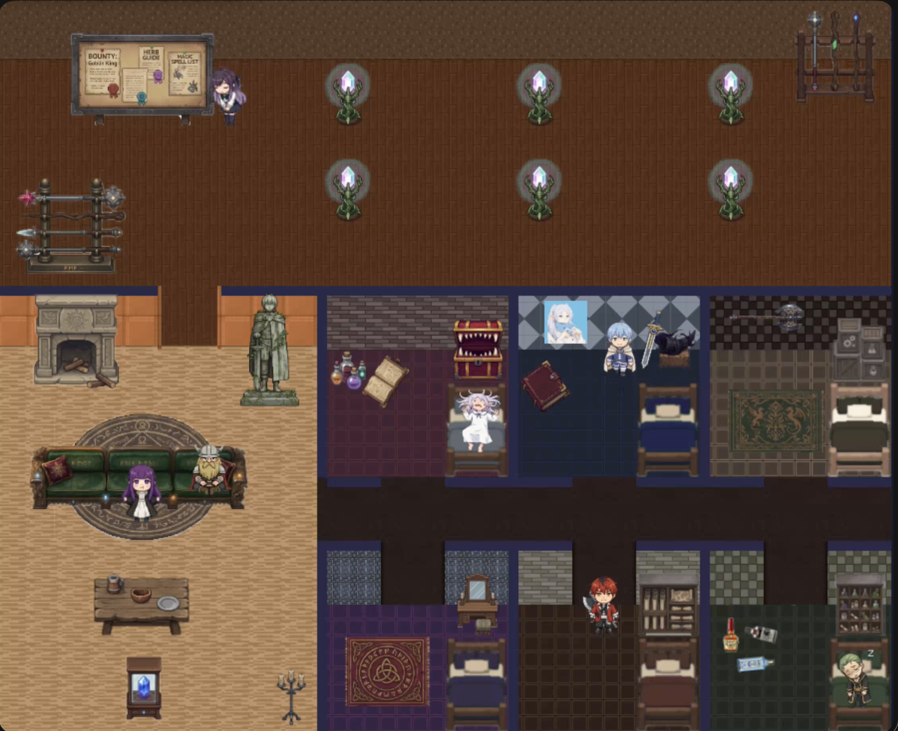
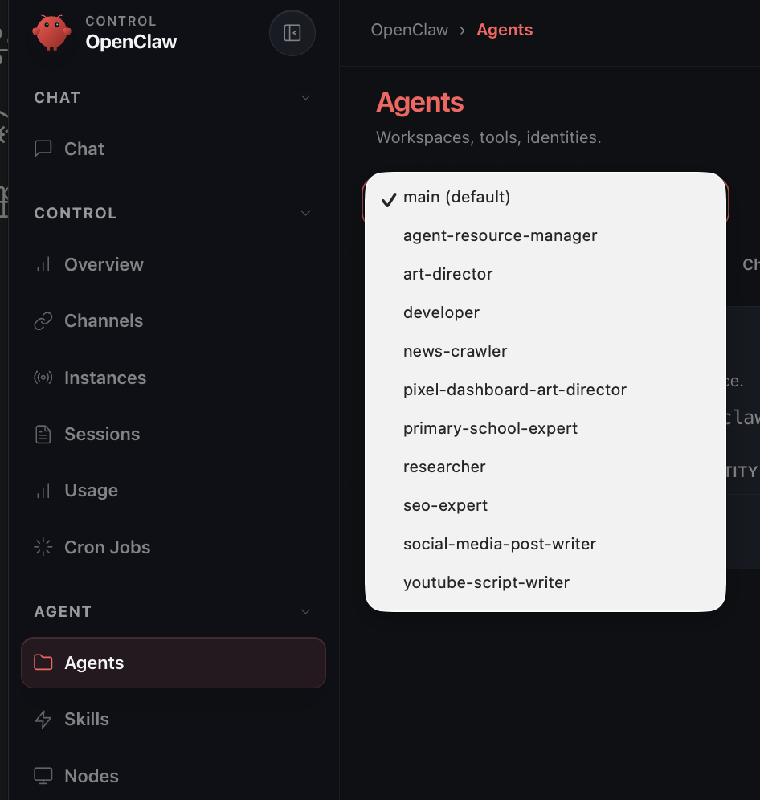

# OpenClaw Character Dashboard — User Guide

Author: An IT-a

[Subscribe and Follow me! ❤️](https://profile.an-it-a.com/)



---

> **Other Languages / Other Documents**
>
> - English version: [README-en.md](./README-en.md)
> - Developer / Technical Reference: [README-tech.md](./README-tech.md)

---

OpenClaw Character Dashboard transforms your [OpenClaw](https://github.com/openclaw/openclaw) AI Agent into a pixel-art animated character living on a map. Each agent has its own private room and moves freely between the office, living room, and bedroom depending on whether it is currently working or idle.

You can completely replace the interface assets with your favorite anime, game, or original characters, **with no programming experience required**.

---

## Before You Begin

You will need:

- A computer running macOS, Linux, or Windows
- [OpenClaw](https://github.com/openclaw/openclaw) installed and running locally, with at least one active agent
- The files in this folder (if you can see this document, you already have them)

**No programming knowledge is required.**

---

## Step 1 — Obtain the Files

You need to download the repository files to your computer first.

**Method A — Clone with Git** (if you have Git installed):

```bash
git clone https://github.com/an-it-a/openclaw-character-dashboard.git
cd openclaw-character-dashboard
```

**Method B — Download ZIP Archive**:

1. Go to the repository page on GitHub.
2. Click the green **Code** button → **Download ZIP**.
3. Extract the ZIP file to a folder on your computer.
4. Open your terminal and navigate to that folder.

---

## Step 2 — Installation

Run the installation script for your operating system. The script will automatically check your environment, install missing components after getting your consent, and complete all initialization.

### macOS or Linux

Open **Terminal**, navigate to this folder, and run:

```bash
./install.sh
```

If you see a "Permission denied" message, run the following first, then try again:

```bash
chmod +x install.sh
```

### Windows — PowerShell (Recommended)

Right-click the **Start** button, select **Windows PowerShell**, navigate to this folder, and run:

```powershell
.\install.ps1
```

If you see a "Cannot run script" error, the installer will prompt you to automatically fix it. Select `Y` to proceed.

### Windows — Command Prompt

Open **Command Prompt (CMD)**, navigate to this folder, and run:

```
install.bat
```

---

## Step 3 — Launch the Dashboard

After installation, the script will generate a startup script for you.

### macOS or Linux

```bash
./run.sh
```

### Windows — PowerShell

```powershell
.\run.ps1
```

### Windows — Command Prompt

```
run.bat
```

Once launched, open your browser and navigate to:

```
http://localhost:5173
```

The dashboard page will load, and your agent character will appear on the map.

---

## Step 4 — Connect to Your OpenClaw

The dashboard needs to know where your OpenClaw installation is located to read agent data.

Open the `.env.local` file in this folder using any text editor (e.g., Notepad, TextEdit, VS Code, etc.), find and modify the following line:

```
OPENCLAW_HOME=/your/.openclaw/path
```

Replace the path with your actual OpenClaw directory. OpenClaw is installed in the user's home directory by default:

- **macOS / Linux:** `~/.openclaw`
- **Windows:** `C:\Users\YourUsername\.openclaw`

### All Configurable Settings

| Setting                            | Purpose                                             | Default Value                |
| ---------------------------------- | --------------------------------------------------- | ---------------------------- |
| `OPENCLAW_HOME`                    | Path to the OpenClaw installation directory         | `~/.openclaw`                |
| `VITE_PUBLIC_DIR`                  | Asset package directory path (where images for characters, rooms, etc. are stored) | `./public`         |
| `VITE_API_PORT`                    | Port number used by the local API server            | `3001`                       |
| `SHARED_ROOT`                      | Root directory for browsing the shared resource wall| `<OPENCLAW_HOME>/shared`     |
| `VITE_SESSION_ACTIVE_THRESHOLD_MS` | Threshold in milliseconds for an agent to be considered "working" based on recent activity | `10000` |

In most cases, you only need to modify `OPENCLAW_HOME`. Leave the rest at their defaults.

After modifying `.env.local`, you must restart the dashboard for changes to take effect.

---

## Step 5 — Map Agents to Characters

Open the `world.json` file in the asset package directory (default path: `public/world.json`).

Locate the `characters` section. The configuration format for each character is as follows:

```json
{
  "id": "frieren",
  "agentId": "main",
  "name": "Frieren",
  "privateRoomId": "private-frieren",
  ...
}
```

- `id` — The folder name of the character under `images/map/characters/`
- `agentId` — Must exactly match the ID of the corresponding agent in OpenClaw (e.g., `main`, `researcher`, `news-crawler`)
- `name` — The character name displayed in the dashboard interface
- `privateRoomId` — The ID of this character's private room, which must correspond to a room ID in the same file

If the `agentId` does not match the actual agent ID in your OpenClaw setup, the character will not respond to real-time data. Verify the correct agent ID in your OpenClaw configuration.



---

## Step 6 — Use Your Own Characters and Rooms (Optional)

You can replace all image assets with your own theme—whether it's your favorite anime, game, VTuber, or original characters.

The easiest way is to copy an existing asset package and modify it:

1. Copy the `public_frieren` folder and rename it to your package name, e.g., `public_myfandom`.
2. Set `VITE_PUBLIC_DIR=./public_myfandom` in `.env.local`.
3. Replace the images inside the folder with your own assets.
4. Edit `world.json` to update character names and agent IDs.

### Asset Package Directory Structure

```
public_myfandom/
  world.json          ← Map layout, room settings, character settings, object positions
  clip-defs.json      ← Animation clip definitions (which frame corresponds to which action)
  images/
    map/
      rooms/          ← Floor and wall tile images for public rooms
      objects/        ← Public object images (desks, sofas, decorations, etc.)
      characters/
        <character_id>/
          inside.png    ← Sprite sheet used indoors (private room)
          outside.png   ← Sprite sheet used in the office
          room/         ← Floor and wall tiles for the character's private room
          object/       ← Exclusive furniture for the character's private room
```

For instructions on generating character sprite sheets and object images using AI tools, refer to:

- **[README-assets.md](./README-assets.md)** — Traditional Chinese AI asset generation guide
- **[README-assets-en.md](./README-assets-en.md)** — English guide for creating assets with AI

---

## Frequently Asked Questions

**Blank page or fails to load**

- Ensure the installation script completed successfully.
- Verify that the dashboard is still running in your terminal.
- Check that `VITE_PUBLIC_DIR` points to the folder containing `world.json`.

**Character has no animations / Does not respond to agent activity**

- Verify that `OPENCLAW_HOME` in `.env.local` is correct.
- Check that the `agentId` in `world.json` exactly matches the actual agent ID in OpenClaw.
- Ensure OpenClaw is currently running.

**Installation script prompts that it cannot install Node.js**

- macOS: Install [Homebrew](https://brew.sh) first, then run `install.sh` again.
- Windows: Manually download and install Node.js 22 from [nodejs.org](https://nodejs.org), then run `install.bat` again.

**Prompt that port 5173 or 3001 is already in use**

- Change `VITE_API_PORT` to another port number (e.g., `3002`) in `.env.local`.

---

## Stopping the Dashboard

Return to the terminal window where the dashboard is running and press `Ctrl + C`.
